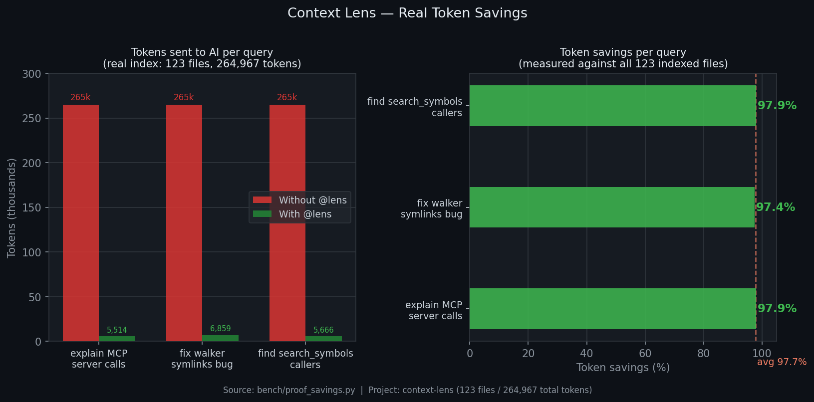

# Context Lens

> 🇺🇸 [Read in English](README.md)

> Indexe uma vez, configure uma vez, esqueça.
> O GitHub Copilot recebe contexto otimizado automaticamente via `@lens` — sem copiar e colar, sem terminal.

**Economia real: ~97,7% tokens** por consulta — medido contra o índice real do projeto.



> **v2.0 — Foco principal: GitHub Copilot** — totalmente testado com o participante de chat `@lens`, atalho `Ctrl+Shift+L` e dashboard em tempo real na extensão VS Code. Outras integrações (Claude Code, Cursor, Codex) usam o servidor MCP e estão em **alpha** — a engine funciona, mas a experiência ponta a ponta nessas ferramentas ainda não foi exaustivamente testada.

---

## Como funciona

Assistentes de IA como Copilot e Claude Code têm limites de contexto (tokens). Quanto maior o projeto, mais código irrelevante preenche a janela e as respostas ficam genéricas.

O `lens` resolve isso em três etapas:

**0. Setup — uma vez por projeto**
`lens setup` detecta seu assistente de IA e configura tudo:
- Copilot recebe a extensão VS Code com `@lens` e `Ctrl+Shift+L`
- Claude Code recebe um servidor MCP que consulta o índice automaticamente
- Codex recebe um `AGENTS.md` com instruções para usar o índice

Após o setup: nenhuma etapa manual.

**1. Indexação — uma vez por projeto**
Lê todos os arquivos e extrai apenas os símbolos: funções, classes, parâmetros, docstrings, números de linha. Salva em um banco SQLite local em `.ctx/index.db`.

**2. No momento da consulta**
Busca no índice FTS5 os símbolos relevantes em ~0,2ms (sem leitura de disco), monta contexto focado dentro do orçamento de tokens. O assistente recebe apenas o trecho certo — automaticamente.

```
Sem lens:  lê todos os 123 arquivos indexados                                     →  264.967 tokens
Com lens:  "corrigir módulo walker para lidar com symlinks"  (5 arquivos)  →    6.859 tokens  (97,4% menos)
```

> Números de `bench/proof_savings.py` rodado no próprio projeto context-lens.

O índice fica em `.ctx/` dentro de cada projeto e é ignorado pelo git.

---

## Dashboard Visual


A extensão VS Code mostra um painel em tempo real na barra lateral (Activity Bar) com:

- **Cards de economia de tokens** — total salvo, média %, economia da sessão
- **Breakdown por tarefa** — economia por tipo (explain, bugfix, refactor...)
- **Breakdown por ferramenta** — economia por ferramenta de IA (Copilot, Claude, Cursor)
- **Consultas recentes** — últimas 4 consultas com badges de tarefa e economia
- **Rastreamento de sessão** — nome da sessão MCP atual, contagem de consultas, indicador ao vivo "⚡ há 3min"
- **Toggle ON/OFF** — ativar/desativar otimização com um clique
- **Botão Re-index** — acionar `lens index` pela barra lateral
- **Atualização automática** — FileSystemWatcher nos arquivos `.ctx/`, sem polling

---

## Arquitetura

```
┌─────────────────────────────────────────────────────────────┐
│  Assistente de IA (Copilot / Claude / Cursor / Codex)        │
│  ↕ MCP stdio                                                │
├─────────────────────────────────────────────────────────────┤
│  Servidor MCP (lens-mcp)                                     │
│  8 ferramentas: search, context, status, symbols,            │
│                 explain_symbol, diff_context, reindex, memory│
│  4 recursos: project/map, project/stats, symbols/{path},     │
│              memory                                          │
├─────────────────────────────────────────────────────────────┤
│  Engine principal                                            │
│  ┌──────────┐ ┌───────────┐ ┌──────────┐ ┌──────────────┐  │
│  │ Indexer   │ │ Retrieval │ │ Context  │ │ Session/Log  │  │
│  │ walker    │ │ FTS5      │ │ builder  │ │ JSONL logger │  │
│  │ extractor │ │ intent    │ │ budget   │ │ SQLite v4    │  │
│  │ hasher    │ │ policy    │ │ levels   │ │ sessions     │  │
│  │ parser    │ │ search    │ │ ranking  │ │ memory_lite  │  │
│  └──────────┘ └───────────┘ └──────────┘ └──────────────┘  │
├─────────────────────────────────────────────────────────────┤
│  SQLite + FTS5 (.ctx/index.db)                              │
└─────────────────────────────────────────────────────────────┘

┌─────────────────────────────────────────────────────────────┐
│  Extensão VS Code (context-lens)                             │
│  Barra lateral Activity Bar · dashboard em tempo real        │
│  FileSystemWatcher em .ctx/ · Toggle ON/OFF · re-index       │
└─────────────────────────────────────────────────────────────┘
```

---

## Instalação

**Pré-requisito:** Python 3.10+.

```bash
# Com tree-sitter (recomendado — parsing preciso)
pip install "context-lens-v2[parse]"

# Com servidor MCP (para Claude Code, Cursor, Continue.dev)
pip install "context-lens-v2[parse,mcp]"

# Tudo (parsing + MCP + tiktoken + file watch)
pip install "context-lens-v2[all,mcp]"
```

Verificar:

```bash
lens --version
```

> **Windows:** se `lens` não for reconhecido após a instalação, adicione o diretório de scripts ao PATH:
> ```powershell
> [Environment]::SetEnvironmentVariable("PATH",
>   [Environment]::GetEnvironmentVariable("PATH","User") + ";$env:LOCALAPPDATA\Packages\PythonSoftwareFoundation.Python.3.13_qbz5n2kfra8p0\LocalCache\local-packages\Python313\Scripts",
>   "User")
> ```
> Feche e reabra o terminal.

**Do código-fonte:**

```bash
git clone https://github.com/TiagoSchr/context-lens
cd context-lens
pip install -e ".[parse,mcp]"
```

**Desinstalar:**

```bash
pip uninstall context-lens-v2
rm -rf .ctx/    # remove o índice do projeto (opcional)
```

---

## Início rápido

Três comandos para começar em qualquer projeto:

```bash
pip install "context-lens-v2[parse,mcp]"
lens index && lens install
lens status
# Pronto. Abra seu assistente de IA.
```

---

## Extensão VS Code

### Instalar

`lens install` **instala a extensão automaticamente** para VS Code e Cursor (se estiverem no PATH):

```bash
lens install   # detecta IDEs, instala extensão + config MCP
```

Ou instale manualmente:

```bash
cd vscode-context-lens
npm install
npm run compile
npx @vscode/vsce package --no-dependencies
code --install-extension context-lens-1.0.0.vsix
```

A barra lateral aparece automaticamente quando `.ctx/index.db` existe no workspace.

---

## Uso com GitHub Copilot (`@lens`)

> O `Ctrl+Shift+L` é exclusivo do **GitHub Copilot no VS Code**. É ele que abre o chat já com `@lens` digitado — você só escreve a pergunta.

Após `lens install`, o fluxo completo é:

```
[cursor no editor]  →  Ctrl+Shift+L  →  Copilot Chat abre com "@lens "  →  digite sua pergunta  →  Enter
```

**Passo a passo:**

1. Com o foco no editor (não em outro chat), pressione `Ctrl+Shift+L`
2. O Copilot Chat abre com `@lens ` já digitado
3. Continue digitando sua pergunta: `@lens corrigir bug no checkout`
4. Pressione Enter — o `@lens` busca o contexto relevante no índice e injeta automaticamente na conversa

> **Importante:** sem o `@lens` na frente, o Copilot responde normalmente sem contexto otimizado.
> O `@lens` é o que aciona o sistema — sempre comece com ele.

> **Economia de tokens:** cada consulta com `@lens` envia **~97% menos tokens** para a IA em comparação ao Copilot lendo os arquivos diretamente. O índice seleciona apenas 3–5 arquivos relevantes de 123+ e injeta só eles — não o projeto inteiro. ([ver benchmark](bench/proof_savings.py))

**Exemplos de consultas:**

```
@lens corrigir bug no método calculate_total
@lens como funciona o sistema de autenticação
@lens escrever testes para a classe Cart
@lens onde está definida a função validate_coupon
```

**O atalho não funciona se:**
- O foco estiver dentro de outro chat (ex: Claude, Codex) — clique no editor primeiro
- A extensão não estiver instalada — rode `lens install`
- Não houver índice no projeto — rode `lens index`

**Outras ferramentas (alpha):**

| Ferramenta | Como funciona |
|------------|--------------|
| Claude Code | Servidor MCP injeta contexto automaticamente |
| Cursor | Servidor MCP injeta contexto automaticamente |
| OpenAI Codex | `AGENTS.md` direciona o Codex automaticamente |

**CLI manual** (controle explícito):

```bash
lens context "corrigir bug no checkout retornando total errado"
lens context "como funciona o sistema de autenticação" -t explain
lens context "escrever testes para a classe Cart" -t generate_test
lens context "onde calculate_discount está definido" -t navigate
```

---

## Servidor MCP

O servidor `lens-mcp` expõe 8 ferramentas e 4 recursos via transporte MCP stdio:

### Ferramentas

| Ferramenta | Descrição |
|------------|-----------|
| `lens_search` | Busca FTS5 de símbolos por nome ou palavra-chave |
| `lens_context` | ⭐ Ferramenta principal — monta contexto otimizado para uma consulta |
| `lens_status` | Estatísticas do índice + resumo de economia de tokens |
| `lens_symbols` | Todos os símbolos em um arquivo específico |
| `lens_explain_symbol` | Mergulho profundo: código-fonte completo + chamadores + docstring |
| `lens_diff_context` | Contexto focado nos arquivos alterados pelo git |
| `lens_reindex` | Acionar reindexação incremental |
| `lens_memory` | CRUD de entradas de memória (regras, notas, hotspots) |

### Recursos

| URI | Descrição |
|-----|-----------|
| `lens://project/map` | Estrutura do projeto (level0) |
| `lens://project/stats` | Estatísticas do índice (JSON) |
| `lens://symbols/{path}` | Símbolos de um arquivo específico |
| `lens://memory` | Todas as entradas de memória |

---

## Uso diário

Após `lens install`, você não precisa mais do terminal para usar o Context Lens.

| | v2.0 (atual) | Status |
|---|---|---|
| **GitHub Copilot** | `Ctrl+Shift+L` → `@lens` → digitar consulta | ✅ Testado |
| Claude Code | Servidor MCP injeta contexto automaticamente | ⚠️ Alpha |
| Cursor | Servidor MCP injeta contexto automaticamente | ⚠️ Alpha |
| OpenAI Codex | `AGENTS.md` direciona o Codex automaticamente | ⚠️ Alpha |

**Uso manual via CLI** (para controle explícito sobre o contexto gerado):

```bash
lens context "corrigir bug no checkout retornando total errado"
lens context "como funciona o sistema de autenticação" -t explain
lens context "escrever testes para a classe Cart" -t generate_test
lens context "onde calculate_discount está definido" -t navigate
```

---

## Setup por projeto

O `lens` funciona **por projeto**, como o `git`. Para cada novo projeto:

```bash
cd meu-novo-projeto/
lens index          # cria .ctx/ aqui e indexa
lens install        # configura todas as integrações detectadas
lens status         # confirma que está ativo e mostra economia
```

---

## Compatibilidade

| Assistente | Status | Modo automático | Configuração |
|-----------|--------|----------------|--------------|
| **GitHub Copilot** | ✅ **Testado** | Participante de chat `@lens` + `Ctrl+Shift+L` | `lens install` |
| Claude Code IDE/CLI | ⚠️ Alpha | Servidor MCP | `lens install` |
| Cursor | ⚠️ Alpha | Servidor MCP | `lens install` |
| OpenAI Codex CLI | ⚠️ Alpha | AGENTS.md + MCP | `lens install` |
| Continue.dev (VS Code) | ⚠️ Alpha | Servidor MCP | `lens install` |
| ChatGPT web | ⚠️ Alpha | Script + clipboard | `lc "query"` |

> **Alpha** significa que os arquivos de configuração e servidor MCP são gerados corretamente, mas a experiência ponta a ponta nessas ferramentas não foi exaustivamente testada. Contribuições e feedback são bem-vindos.

---

## Economia de tokens por tipo de tarefa

| Tarefa | Quando usar | Economia típica |
|--------|-------------|-----------------|
| `navigate` | "onde X está definido?" | **60–85%** |
| `generate_test` | "escrever testes para X" | **50–75%** |
| `explain` | "como X funciona?" | **40–65%** |
| `refactor` | "refatorar X" | **45–70%** |
| `bugfix` | "corrigir bug em X" | **25–55%** |

A tarefa é detectada automaticamente pela consulta. Use `-t` para substituir:

```bash
lens context "corrigir bug no checkout" -t bugfix --file src/cart.py
```

---

## Todos os comandos

```bash
lens index                           # indexação incremental
lens index --force                   # re-indexar tudo do zero
lens index --verbose                 # mostrar cada arquivo
lens status                          # saúde + economia de tokens
lens watch                           # monitorar mudanças e re-indexar (background)
lens stats                           # arquivos, símbolos, linguagens
lens search "consulta"               # buscar símbolos
lens context "consulta"              # montar contexto (tarefa detectada automaticamente)
lens context "consulta" -t bugfix    # tarefa explícita
lens context "consulta" --file x.py  # forçar inclusão de arquivo
lens context "consulta" --budget 12000  # orçamento personalizado
lens context "consulta" -o saida.md  # salvar em arquivo
lens show map                        # mapa do projeto
lens show symbol:nome                # detalhes do símbolo
lens show file:src/modulo.py         # símbolos do arquivo
lens log                             # histórico de consultas e tokens
lens log --last 10                   # últimas 10 consultas
lens memory list                     # listar memória do projeto
lens memory set rule chave "valor"   # adicionar regra (aparece em todo contexto gerado)
lens memory set hotspot file "src/core.py"  # marcar arquivo como crítico
lens install                         # configurar integrações de assistente de IA
lens config                          # configuração atual
```

---

## Estrutura criada no projeto

```
seu-projeto/
  .ctx/
    config.json     ← orçamento, extensões, diretórios ignorados
    index.db        ← banco SQLite com símbolos + FTS5
    log.jsonl       ← histórico de consultas e tokens
    stats.json      ← estatísticas do índice para a extensão VS Code
    session.json    ← sessão MCP atual (gerenciada automaticamente)
```

Tudo em `.ctx/` é local e nunca vai para o git.

---

## Configuração (`.ctx/config.json`)

```json
{
  "token_budget": 8000,
  "target_budgets": {
    "claude": 8000,
    "copilot": 4000,
    "codex": 6000
  },
  "budget_buffer": 0.12,
  "index_extensions": [".py", ".js", ".ts", ".tsx", ".go", ".rs"],
  "ignore_dirs": [".git", "node_modules", ".venv", "dist"],
  "max_file_size_kb": 512,
  "enabled": true
}
```

- `target_budgets` — orçamentos por ferramenta (detectados automaticamente via variáveis de ambiente)
- `budget_buffer` — margem de segurança de 12% para evitar estouro de orçamento
- `enabled` — toggle via extensão VS Code ou manualmente (respeitado por todas as ferramentas de dados MCP)

---

## Linguagens suportadas

| Linguagem | Parser | Extrai |
|-----------|--------|--------|
| Python | tree-sitter | funções, classes, decoradores, docstrings |
| JavaScript | tree-sitter | funções, classes, métodos, arrow functions |
| TypeScript / TSX | tree-sitter | igual ao JS + interfaces |
| Go, Rust, Java, C, C++ | regex | funções, structs, classes |
| Ruby, PHP, C#, Swift, Kotlin | regex | funções, classes |

---

## Performance

| Operação | Velocidade |
|----------|-----------|
| Indexação completa | ~320 arquivos/seg |
| Re-indexação incremental (sem mudanças) | ~5.500 arquivos/seg |
| Busca FTS5 | ~0,2ms |
| Montagem de contexto | ~1–5ms |
| RAM durante uso | ~3–5MB |
| Escala | testado com 640 arquivos / 7.000 símbolos |

---

## Changelog

### v2.0 — Abril 2025

#### Lançamento principal: Extensão VS Code + métricas honestas + rastreamento de sessão

**Extensão VS Code — dashboard em tempo real**
- Barra lateral Activity Bar com cards de economia de tokens, breakdown por tarefa/ferramenta, consultas recentes
- Rastreamento de sessão — mostra nome da sessão MCP atual, contagem de consultas, indicador ao vivo "⚡ há 3min"
- Toggle ON/OFF — ativar/desativar otimização com um clique (escreve em `.ctx/config.json`)
- Botões de re-index e refresh
- FileSystemWatcher em `.ctx/` — zero polling, atualizações instantâneas
- CSP nonce para segurança, `escHtml` em todo lugar para prevenir XSS

**Servidor MCP v2 — 8 ferramentas + 4 recursos**
- `lens_diff_context` — contexto focado em arquivos alterados pelo git
- `lens_explain_symbol` — código-fonte completo + mergulho em chamadores
- `lens_memory` — CRUD de entradas de memória via MCP
- `lens_reindex` — agora escreve `stats.json` + atualiza `project_tokens_total`
- Detecção automática de Copilot, Cursor, Claude Code, Codex via variáveis de ambiente
- Orçamentos por ferramenta (`target_budgets` na config)
- Cache de contexto (TTL 60s) para consultas idênticas
- Shutdown gracioso — sessões fechadas, `session.json` limpo na saída

**Economia de tokens honesta**
- Baseline de `tokens_raw` mudou de "projeto inteiro" para "tokens brutos dos arquivos incluídos"
- Porcentagens de economia agora refletem o comportamento realista da ferramenta de IA

**Sistema de sessão (SQLite v4)**
- Cada tempo de vida do servidor MCP = uma sessão com timestamps de início/fim
- ID de sessão propagado para todas as entradas de log
- `session.json` escrito para a extensão VS Code, limpo automaticamente no shutdown

**363 testes Python + 59 asserções TypeScript**

---

### v0.2 — Março 2025

- `lens setup` — configuração automática de múltiplas ferramentas
- `lens status` — economia projetada antes da primeira consulta
- Memória do projeto injetada no contexto gerado
- Correções: duplicatas de memória, falha silenciosa do FTS5, versão do tree-sitter
- Queries N+1 eliminadas no montador de contexto

### v0.1 — Lançamento inicial

- Indexação incremental com SHA-1
- Busca FTS5 com stop words e priorização de identificadores técnicos
- Montagem de contexto por nível (L0 mapa, L1 assinaturas, L2 esqueleto, L3 fonte)
- Políticas por tarefa (navigate, explain, bugfix, refactor, generate_test)
- Servidor MCP para Claude Code, Continue.dev e Cursor
